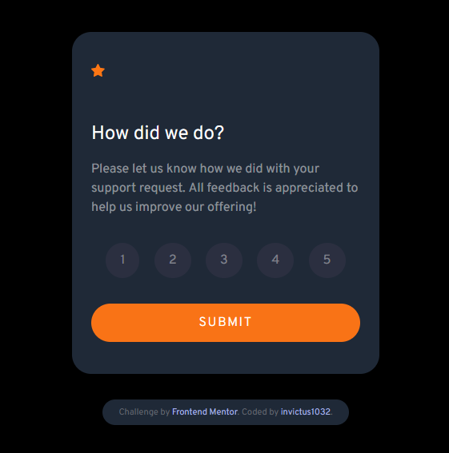
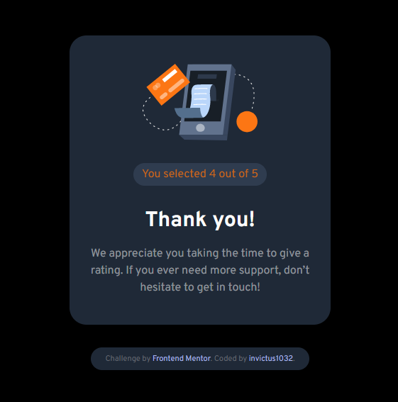

# Frontend Mentor - Interactive rating component solution

This is a solution to the [Interactive rating component challenge on Frontend Mentor](https://www.frontendmentor.io/challenges/interactive-rating-component-koxpeBUmI). Frontend Mentor challenges help you improve your coding skills by building realistic projects. 

## Table of contents

- [Overview](#overview)
  - [The challenge](#the-challenge)
  - [Screenshot](#screenshot)
  - [Links](#links)
- [My process](#my-process)
  - [Built with](#built-with)
  - [What I learned](#what-i-learned)
- [Author](#author)

**Note: Delete this note and update the table of contents based on what sections you keep.**

## Overview

### The challenge

Users should be able to:

- View the optimal layout for the app depending on their device's screen size
- See hover states for all interactive elements on the page
- Select and submit a number rating
- See the "Thank you" card state after submitting a rating

### Screenshot

- 
- 

### Links

- Solution URL: [Add solution URL here](https://your-solution-url.com)
- Live Site URL: [Add live site URL here](https://your-live-site-url.com)

## My process

### Built with

- Semantic HTML5 markup
- Tailwindcss
    - Flexbox
    - CSS Grid
- Mobile-first workflow

### What I learned

I encountered dozens of problems, as result, I learned dozens of lessons. The main realization I got was how customizable tailwind actually is. I used to hate it as it cluttered my HTML. I didn't know you could extract complex styling into its own class with @apply. 

**Before**:
```html
<section id="state_rating" class="flex bg-gray-800 rounded-3xl flex-col gap-8 px-6 py-10">
```

**After**
```html
<section id="state_rating" class="flex card">
```
```css
@layer components {
    .card {
        @apply bg-gray-800 rounded-3xl flex-col gap-8 px-6 py-10;
    }
}
```

## Author

- [@invictus1032](https://www.frontendmentor.io/profile/invictus1032)
